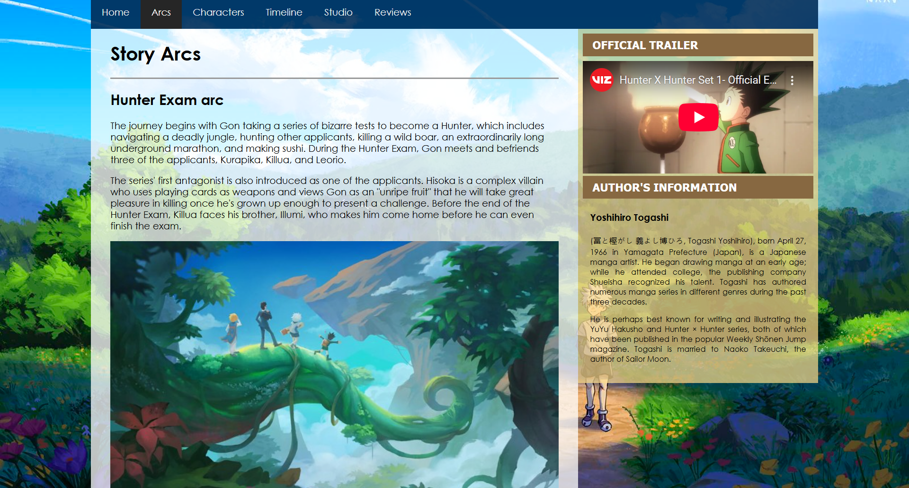

# Hunter × Hunter Wiki

   

  

A Hunter × Hunter Wiki made using vanilla HTML + CSS. This was designed around the 2011 adaptation of the manga.

## Author's Notes

I did this project for my computer subject in Senior High. I really love Hunter × Hunter and I have rewatched this series multiple times. This wiki was a tribute to the experience it gave me.

## Screenshots

    <h3>Home Tab</h3>
    
    <h3>Arcs Tab</h3>
    
    <h3>Characters Tab</h3>
    
    <h3>Timeline Tab</h3>
    
    <h3>Studio Tab</h3>
    
    <h3>Reviews Tab</h3>
    

## How to Run

You can download the source code and run `index.html` in any browser.

## Feedback

If you have any feedback/comment/request, please reach out to [aquino.ylt@gmail.com](mailto:aquino.ylt@gmail.com).

### Thank you and God bless!